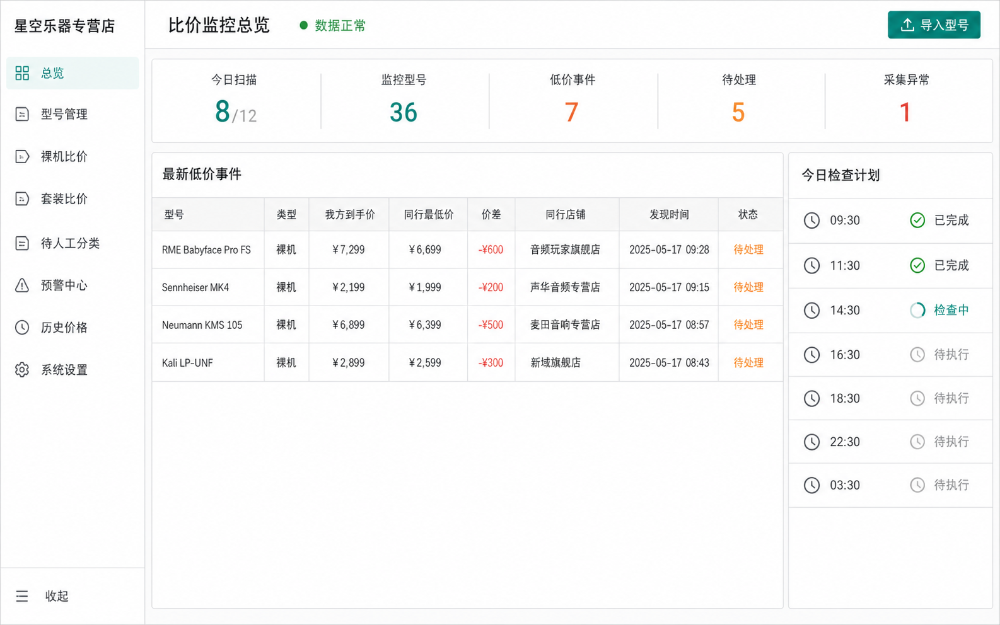

# 比价工具

用于天猫同行价格监控、企业微信提醒和运营处理留痕的本地部署工具。系统只监控、提醒和记录，不自动修改电商平台价格；最终是否调整价格始终由运营人员在平台后台人工决定。



## 功能与架构

- 管理重点型号，区分裸机与套装，并按固定计划检查。
- 对可比的同行具体 SKU 计算到手价；低于我方到手价 `0.01 元` 即生成预警。
- 通过企业微信通知，记录人工处理结果、原因和审计信息。
- `apps/api` 提供 API、采集与规则；`apps/web` 提供运营后台；PostgreSQL 保存业务数据，Redis 支持计划任务。

## 运行环境

需要 Node.js 22、pnpm 11.19.0 和 Docker Desktop。macOS 请参阅 [Terminal 设置指南](docs/operations/macos-setup.md)，Windows 请参阅 [PowerShell 设置指南](docs/operations/windows-setup.md)。Linux 可按以下同一套命令运行。

安装依赖并创建本地环境后，使用 `pnpm run doctor` 检查 Node.js、pnpm、Docker、Docker Compose 和 `.env`。必须使用 `pnpm run doctor`：pnpm 11 的裸 `pnpm doctor` 是内置命令冲突，不会运行仓库的环境诊断脚本。

## 快速启动

在仓库根目录依次执行以下命令。`pnpm setup` 只会在 `.env` 不存在时创建它，不会覆盖现有本地配置。

```bash
pnpm install
pnpm setup
pnpm infra:up
pnpm db:generate
pnpm db:migrate
pnpm seed:demo
```

分别在两个终端窗口启动 API 和管理后台：

```bash
pnpm dev:api
```

```bash
pnpm dev:web
```

API 默认监听 `http://127.0.0.1:4100`；管理后台开发服务器会在启动后显示本地访问地址。首次启动前，在 `pnpm setup` 之后运行 `pnpm run doctor`，并在 Docker 服务就绪后再执行数据库命令。

演示种子仅用于本地开发，不得用于生产环境。生产部署、反向代理和密钥管理请参阅[部署手册](docs/operations/deployment-guide.md)。

## 测试

```bash
pnpm setup
pnpm db:generate
pnpm verify:portable
```

全新克隆需先运行 `pnpm setup` 创建本地环境，再运行 `pnpm db:generate` 生成 Prisma Client。`pnpm verify:portable` 运行不依赖 PostgreSQL 和 Redis 的跨平台测试、类型检查和前端生产构建。已启动本地基础设施并完成迁移后，可运行完整验证：

```bash
pnpm verify
```

## 真实数据源边界

真实天猫搜索必须由部署方另行选择并验收合规的 `CommerceProvider`，包括数据来源、鉴权、限额、字段映射和价格准确率。此仓库不包含可直接用于真实天猫搜索的供应商，也不提供依赖普通淘宝账号登录的高频网页采集。

仓库仅随附固定 fixtures 和手工导入 fallback，供开发、测试和演示使用。接入真实数据前，请遵守平台规则、供应商合同和适用法律，并完成供应商契约测试和人工抽检。

## 安全与许可证

安全问题请按 [SECURITY.md](SECURITY.md) 中的 GitHub 私密漏洞报告流程提交。请勿在 Issue、截图、日志或普通聊天中发布密钥、Webhook、Cookie 或账号信息。

本仓库目前不附开源许可证。公开可见不表示已授权复制、修改、分发或商业使用；任何授权安排由权利人另行明确。
